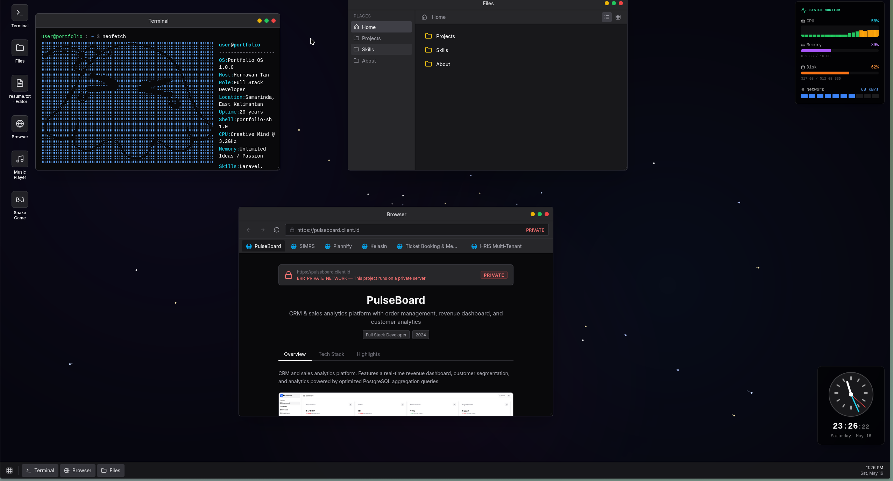
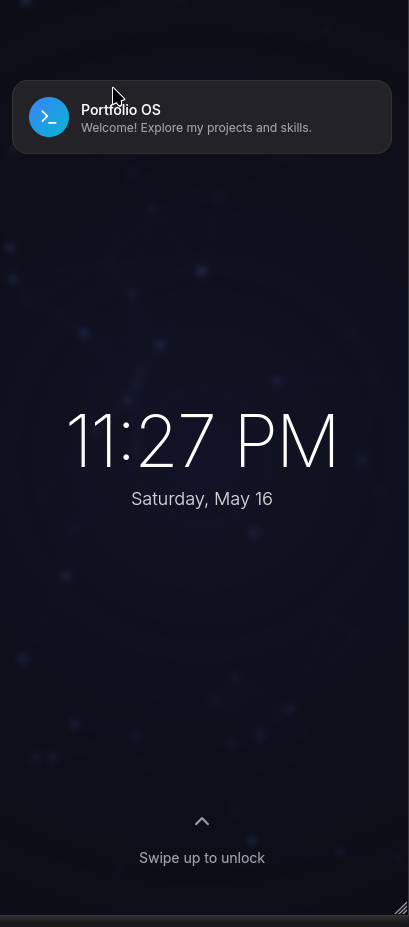
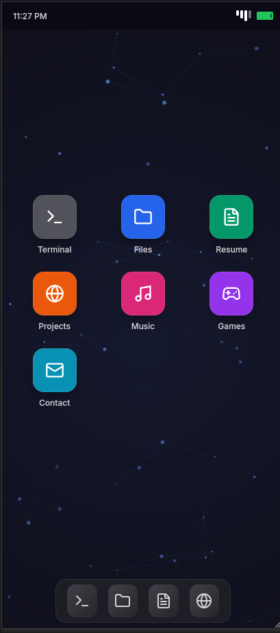

# Hermawan Tan - Portfolio OS

[](https://nuxt.com/)
[](https://vuejs.org/)
[](https://tailwindcss.com/)
[](https://pinia.vuejs.org/)

An interactive portfolio that mimics a desktop OS and a mobile launcher. It boots, opens apps, and presents my work, resume, and contact details through a simulated workspace.

Live demo: https://hermawantan.com

## Table of Contents

- [Features](#features)
- [Tech Stack](#tech-stack)
- [How It Works](#how-it-works)
- [Project Structure](#project-structure)
- [Setup](#setup)
- [Development](#development)
- [Production](#production)
- [Screenshots](#screenshots)

## Highlights

- Desktop OS-inspired portfolio with a boot sequence and windowed apps
- Built-in terminal, browser-style project viewer, file manager, and resume editor
- Mobile mode with lock screen, app grid, and dock
- Terminal commands that surface portfolio data (`whoami`, `neofetch`, `ls`, `cat`)
- Single source of truth for all portfolio content

## Tech Stack

| Layer | Technology |
|-------|-----------|
| Framework | Nuxt 4 |
| UI | Vue 3 |
| Styling | Tailwind CSS |
| State | Pinia |
| Icons | lucide-vue-next |
| Build | Vite (via Nuxt) |

## About This Portfolio

### Desktop Experience

The app starts with a boot sequence, then lands in a desktop UI that spawns apps as windows. The terminal opens with a `neofetch`-style output, and the browser app opens by default.

### Content Source

All portfolio content (profile, experience, skills, projects, awards) is sourced from a single data file and rendered across the UI, including the resume editor, browser project pages, and terminal responses.

### Mobile Mode

On mobile, the experience switches to a phone-like UI with a lock screen, app grid, and dock, keeping the same content but optimized for touch.

## Project Structure

```
app/
├── app.vue
├── globals.css
├── data/
│   ├── portfolio.ts
│   ├── file-system.ts
│   └── mobile-apps.ts
├── components/
│   ├── Boot/
│   ├── Desktop/
│   ├── Terminal/
│   ├── Browser/
│   ├── FileManager/
│   ├── TextEditor/
│   └── Mobile/
├── commands/
├── composables/
├── stores/
└── types/
```

## Setup

Install dependencies:

```bash
# npm
npm install

# pnpm
pnpm install

# yarn
yarn install

# bun
bun install
```

## Development

Start the dev server at `http://localhost:3000`:

```bash
# npm
npm run dev

# pnpm
pnpm dev

# yarn
yarn dev

# bun
bun run dev
```

## Production

Build for production:

```bash
# npm
npm run build

# pnpm
pnpm build

# yarn
yarn build

# bun
bun run build
```

Preview the production build locally:

```bash
# npm
npm run preview

# pnpm
pnpm preview

# yarn
yarn preview

# bun
bun run preview
```

## Screenshots




